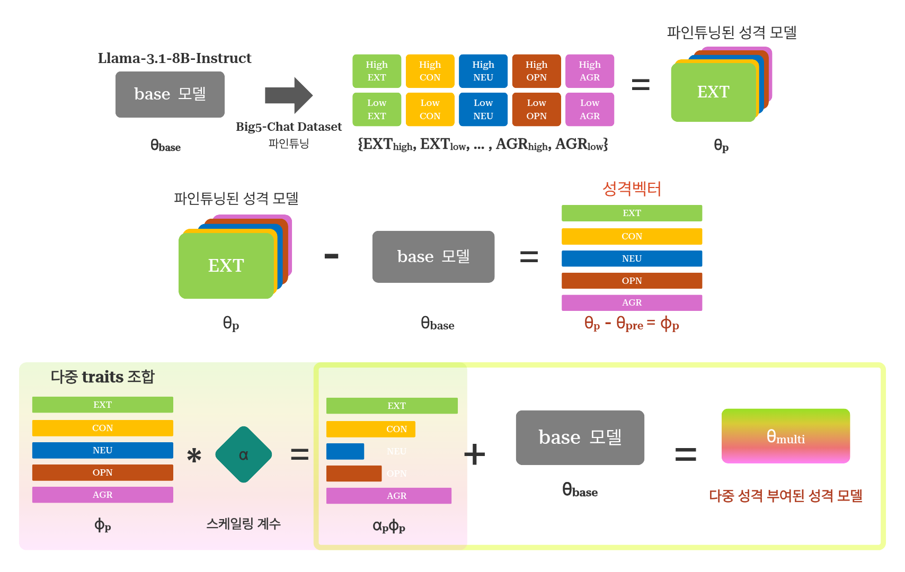

# LLM 기반 확장 가능한 AI 성격 제어 시스템
### Scalable Personality Control for LLM-based Agents via Personality Vector Merging

### Paper
Personality Vector: Modulating Personality of Large Language Models by Model Merging (Published in EMNLP 2025 Main Conference🥳) [](https://arxiv.org/abs/2509.19727)

---

### Personality Vector Project
<p align="center">
  
</p>

> 프롬프트가 아닌 모델 파라미터 차이(Personality Vector)로 성격을 정의하고, α 스케일링 + 모델 병합으로 성격 강도/조합을 연속적으로 제어합니다.  
> Define personality as parameter deltas and enable continuous control via α-scaling and model merging.

---

## 1. 문제 정의
Problem

- 대화형 AI 개인화가 **응답 내용**을 넘어 성격/행동 스타일로 확장됨  
  Personalization is moving from response-level tuning to personality/behavior style.
- 프롬프트 기반 성격 설정은 일관성/재현성/확장성이 낮음  
  Prompt-based persona control has limited consistency, reproducibility, and scalability.
- 사용자 수준에서 조절 가능하고 확장 가능한 성격 제어 방식이 필요  
  A user-controllable and scalable personality control mechanism is needed.

---

## 2. 해결 전략
Approach

- 성격을 프롬프트가 아닌 모델 간 파라미터 차이(벡터)로 구조화  
  Structure personality as parameter deltas (vectors) rather than prompts.
- α 스케일링으로 성격 강도를 연속적으로 조절  
  Control intensity continuously using α-scaling.
- 다중 성격 조합을 모델 병합으로 확장 가능하게 설계  
  Support multi-trait composition via model merging.

---

## 3. 시스템 구조
Architecture
<p align="center">
  
</p

- Base Model(θ_base) + Personality-tuned Model(θ_p)  
  Base model plus personality-specialized fine-tuned models.
- Personality Vector ϕ_p = (θ_p − θ_base)  
  Personality is represented as parameter deltas.
- Merged Model θ = θ_base + α · ϕ_p (및 다중 조합)  
  Merge by adding scaled deltas (and multi-trait composition).

---

## 4. 리포 구조
Structure

- `model_merge/` : 병합 파이프라인 및 merging methods  
  Merging pipeline and merging methods.
- `interview/` : 프롬프트/테스트 스크립트(성격 발현 확인용)  
  Interview prompts and evaluation scripts (personality elicitation).
- `image/` : 아키텍처 이미지  
  Architecture figures.
- `docs/` : 기획 문서(문제-해결-검증)  
  Product-style docs (problem-solution-validation).

---

## 5. Quickstart
> 아래 커맨드는 예시이며, 실제 모델 경로/환경에 맞게 수정하세요.  
> Commands are examples; update paths for your environment.

### 5.1 모델 병합
```bash
bash model_merge/merge.sh
```

### 5.2 성격 발현 Interview
```bash
bash interview/interview.sh
```
